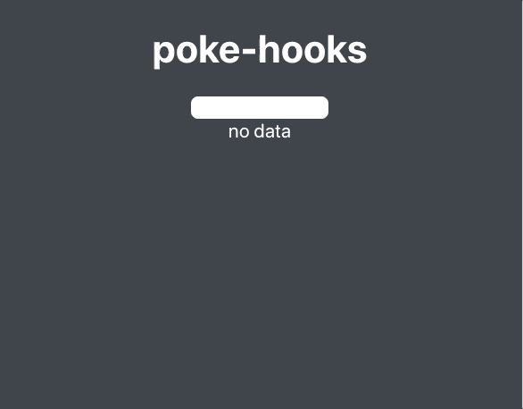

# poke-hooks

> ## React Hooks for [Pokemon API](https://pokeapi.co/) with Typescript

<center>



</center>
## usePokemon

```typescript
usePokemon(name: string | number) : {
  data: Pokemon | null;
  isLoading: boolean;
}
```

## Example

```typescript
import { usePokemon } from "poke-hooks";

const Poke = () => {
  const { data, isLoading } = usePokemon("pikachu"); // set name or number
  if (isLoading) {
    return <div>loading... </div>;
  }
  return (
    <div>
      <p> name: {data.name} </p>
    </div>
  );
};
```

## [Types Definition](./src/types/pokemon.ts)
